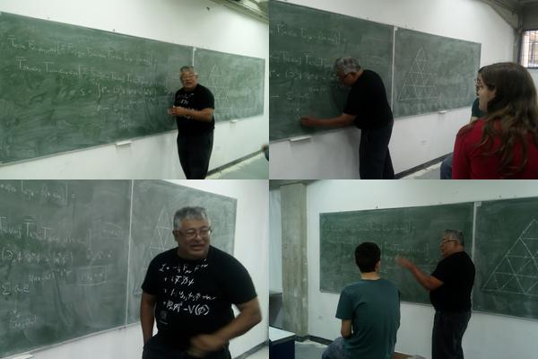

## Mario Iván Caicedo

<!-- You can use the [editor on GitHub](https://github.com/mario-i-caicedo-ai/Mario_I_Caicedo_1/edit/main/README.md) to maintain and preview the content for your website in Markdown files. 

Whenever you commit to this repository, GitHub Pages will run [Jekyll](https://jekyllrb.com/) to rebuild the pages in your site, from the content in your Markdown files. 

### Markdown

Markdown is a lightweight and easy-to-use syntax for styling your writing. It includes conventions for

```markdown
Syntax highlighted code block

# Header 1 xxx
## Header 2
### Header 3

- Bulleted
- List

1. Numberedhttps://towardsdatascience.com/how-to-create-a-free-github-pages-website-53743d7524e1
2. List

**Bold** and _Italic_ and `Code` text

[Link](url) and 
```

For more details see [Basic writing and formatting syntax](https://docs.github.com/en/github/writing-on-github/getting-started-with-writing-and-formatting-on-github/basic-writing-and-formatting-syntax).

-->

I am a venezuelan/colombian [Theoretical Physicist](https://scholar.google.co.ve/citations?user=ybqui-EAAAAJ&hl=en){:target="_blank" rel="noopener"} who, after 33 years in the academy at [Universidad Simón Bolívar](http://www.usb.ve/){:target="_blank" rel="noopener"}, am making a soft transition to
the fantastic world of Data Science.

As you can see, in the headings, this is my first GutHub web page, to create it I just closely followed the instructions given in [this tutorial](https://www.youtube.com/watch?v=BA_c3bGQXlQ){:target="_blank" rel="noopener"}, I also benefited from this nice [article](https://towardsdatascience.com/how-to-create-a-free-github-pages-website-53743d7524e1){:target="_blank" rel="noopener"}, finally, I wanted the links to open in new tabs and found this GitHub specific [solution](https://stackoverflow.com/questions/41915571/open-link-in-new-tab-with-github-markdown-using-target-blank){:target="_blank" rel="noopener"} in everyone's friend stack**overflow**

Needless to say, Physics is great fun, and so it is Data Science. Since the latter is so fashionable right now I will tell you that if you want to join the field, you will need to **seriously** study statistics, linear algebra and calculus. You will also will need lots and lots of coding in [Python](https://www.python.org/){:target="_blank" rel="noopener"} and [R](https://www.r-project.org/){:target="_blank" rel="noopener"}; you will also need to learn about SQL and NonSQL databases, for the former I strongly recommend [PostgreSQL](https://www.postgresql.org/){:target="_blank" rel="noopener"} and for the latter the open source version of [MongoDB](https://www.mongodb.com/try/download/community){:target="_blank" rel="noopener"}

Well, I have just began, and did not think to much about content, while I do, I present you with some of my teaching repos and some  images. 

* [Ondas y Óptica](https://github.com/mario-i-caicedo-ai/Ondas-y-Optica){:target="_blank" rel="noopener"}

* [Relatividad Especial](https://github.com/mario-i-caicedo-ai/Relatividad){:target="_blank" rel="noopener"}

* [Introducción al Aprendizaje Automático](https://github.com/mario-i-caicedo-ai/Aprendizaje-Automatico-Machine-Learning-){:target="_blank" rel="noopener"}

<figure>
  
  <figcaption>Fig.1 - Yours truly having fun while discussing mathematical physics.</figcaption>
</figure>

<figure>
  
  <figcaption>Fig.1 - Caracas, Venezuela.</figcaption>
</figure>

<figure>
  
  <figcaption>Fig.2 - Archipiélago Los Roques, Venezuela.</figcaption>
</figure>

<figure>
  
  <figcaption>Fig.3 - Salto Angel, Venezuela.</figcaption>
</figure>

<!-- ### Jekyll Themes

Your Pages site will use the layout and styles from the Jekyll theme you have selected in your [repository settings](https://github.com/mario-i-caicedo-ai/Mario_I_Caicedo_1/settings/pages). The name of this theme is saved in the Jekyll `_config.yml` configuration file.


### Support or Contact

Having trouble with Pages? Check out our [documentation](https://docs.github.com/categories/github-pages-basics/) or [contact support](https:/Caracas/support.github.com/contact) and we’ll help you sort it out.
-->
